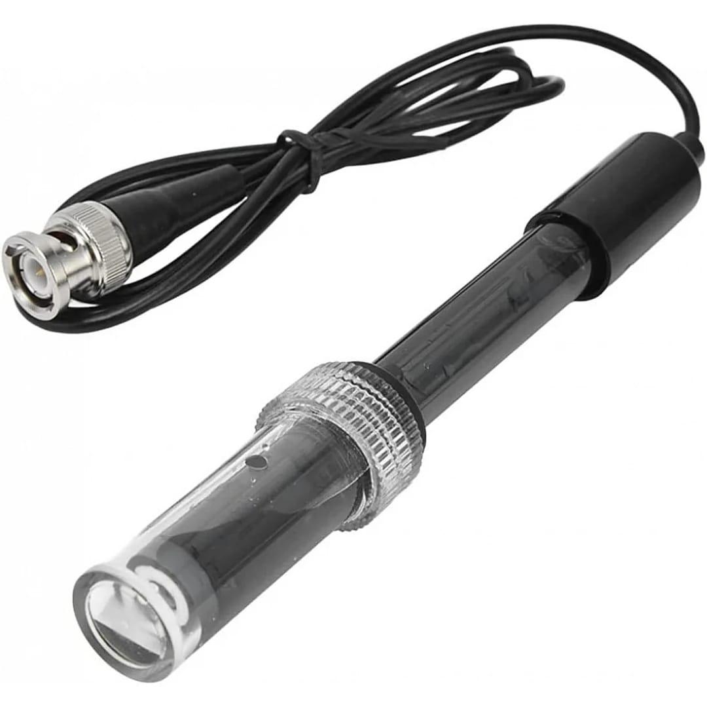
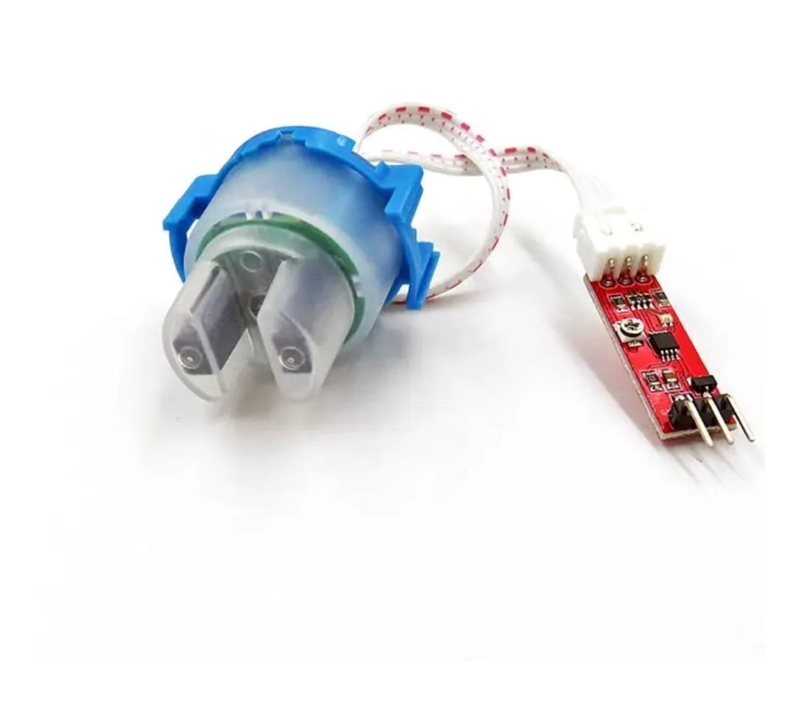
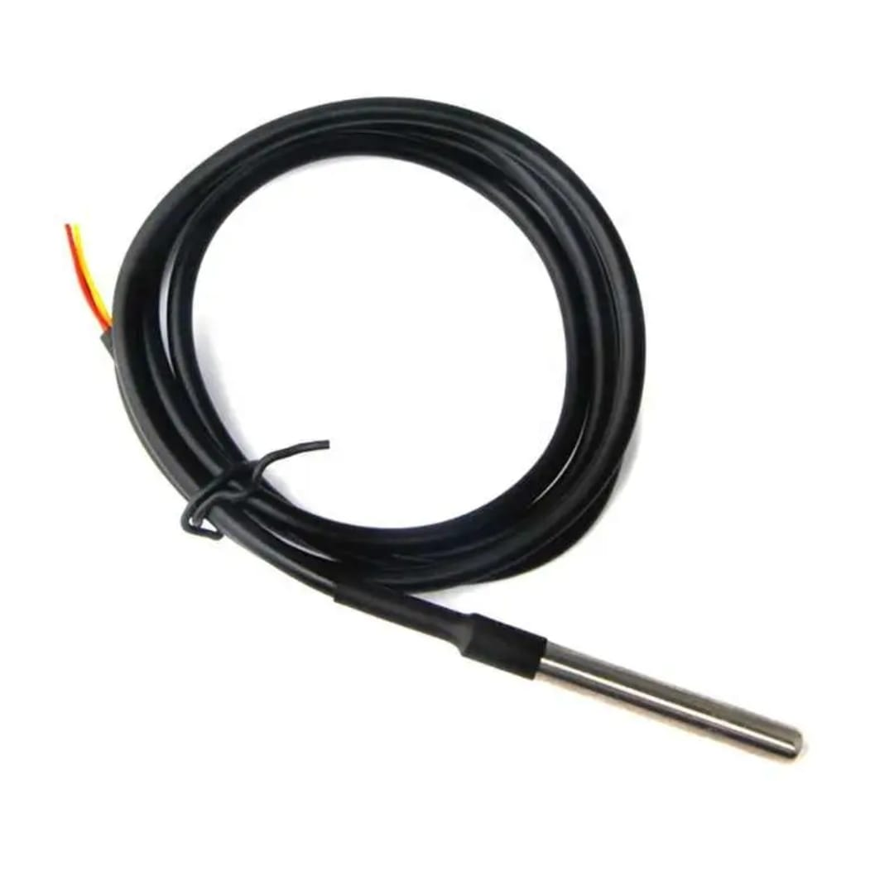

🌊 Aquaculture Monitoring System

Keeping fish healthy starts with knowing your water.

Fish don't complain. By the time you notice something's wrong — fish gasping at the surface, unusual deaths, stunted growth — the water quality has already been bad for hours, maybe days. This project exists to catch those problems early, automatically, and from your phone.
The Aquaculture Monitoring System is an affordable, ESP32-based IoT solution that continuously watches your pond or tank. It tracks temperature, pH, and turbidity around the clock, pushes live data to the cloud, and alerts you the moment something drifts outside safe limits — so you can act before it costs you.

🎯 The Problem It Solves
Manual water testing is:

Slow — you check once a day, problems happen overnight
Inconsistent — human error, missed readings, forgotten logs
Reactive — you find out after damage is done

This system is continuous, consistent, and proactive. Set it up once. Let it run. Check your phone when it calls.

✨ Features
FeatureDescription🌡️ Temperature MonitoringReal-time readings via DS18B20 waterproof sensor💧 pH MeasurementContinuous water acidity/alkalinity tracking🌫️ Turbidity DetectionOptical clarity sensing to catch algae blooms & debris📡 Wi-Fi ConnectivityLive data pushed to cloud via ESP32📱 Mobile DashboardMonitor everything from the Blynk app, anywhere⚠️ Smart AlertsInstant notification when any value exceeds safe limits

🛠️ Hardware
What You'll Need
ComponentRoleESP32 MicrocontrollerBrain of the system — handles processing & Wi-FiDS18B20 SensorWaterproof temperature probe, designed for submersionpH Sensor ModuleAnalog probe + signal conditioning boardTurbidity SensorOptical sensor measuring water clarityJumper WiresConnectionsBreadboard / PCBPrototyping or final assemblyPower Supply5V DC (or solar — see Future Plans)
Sensor Reference
<table>
<tr>
<td align="center"><b>🔵 pH Sensor</b><br></td>
<td align="center"><b>🌊 Turbidity Sensor</b><br></td>
<td align="center"><b>🌡️ DS18B20 Temp Sensor</b><br></td>
</tr>
</table>

💻 Software & Tools

Arduino IDE — firmware development & flashing
Blynk IoT Platform — cloud backend + mobile dashboard
C / C++ — embedded firmware language

Required Libraries
cpp#include <WiFi.h>
#include <BlynkSimpleEsp32.h>
#include <OneWire.h>
#include <DallasTemperature.h>
```

Install all via Arduino IDE → *Tools → Manage Libraries*

---

## 🔌 System Architecture
```
[ DS18B20 ]  ──┐
[ pH Sensor ] ──┤──▶ [ ESP32 ] ──▶ [ Wi-Fi ] ──▶ [ Blynk Cloud ] ──▶ [ 📱 Mobile App ]
[ Turbidity ] ──┘         │
                     [ Alert Logic ]
                     (threshold check)
Data flow:

Sensors sample water continuously
ESP32 reads + processes raw analog/digital signals
Converted values are sent to Blynk cloud over Wi-Fi
Blynk app displays live gauges and logs on your phone
If any value crosses a threshold → alert fires instantly


📊 Ideal Water Conditions
These are the target ranges the system monitors against:
ParameterIdeal RangeRisk if Outside Range🌡️ Temperature20°C – 30°CStress, low oxygen, disease susceptibility💧 pH6.5 – 8.5Gill damage, immune suppression, death🌫️ Turbidity< 50–80 NTUOxygen depletion, algae blooms, infection

⚙️ Getting Started
1. Clone the Repository
bashgit clone https://github.com/yourusername/aquaculture-monitor.git
cd aquaculture-monitor
```

### 2. Install Arduino IDE + Libraries

Open Arduino IDE and install the following via *Manage Libraries*:
```
WiFi | Blynk | OneWire | DallasTemperature
3. Configure Your Credentials
In the main .ino file, fill in your details:
cpp#define BLYNK_AUTH_TOKEN "your_token_here"

char ssid[] = "your_wifi_name";
char pass[] = "your_wifi_password";
4. Wire Up the Sensors
SensorESP32 PinDS18B20 DataGPIO 4pH Sensor (Analog)GPIO 34Turbidity (Analog)GPIO 35

📎 Full wiring diagram available in /docs/circuit_diagram.pdf

5. Flash & Run
bash# Select board: ESP32 Dev Module
# Select correct COM port
# Hit Upload ▶
Open the Blynk app, load your project with the Auth Token, and you should see live data within seconds.

🔮 What's Coming Next
This is a working prototype. Here's where it's headed:

 Auto water filtration — trigger pumps when turbidity exceeds threshold
 AI health prediction — ML model to flag abnormal patterns before crisis
 WhatsApp / SMS alerts — not just app notifications
 Solar-powered enclosure — fully off-grid for remote ponds
 Historical analytics dashboard — trends, not just live snapshots
 Multi-tank support — manage several ponds from one dashboard
